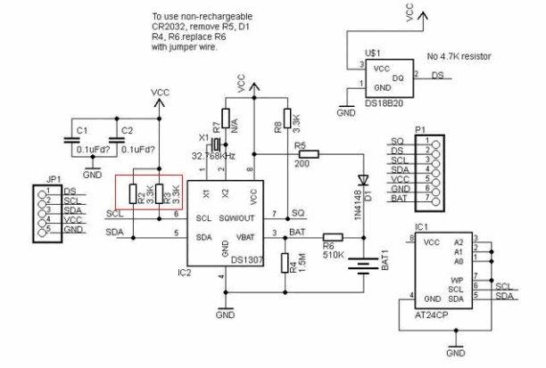
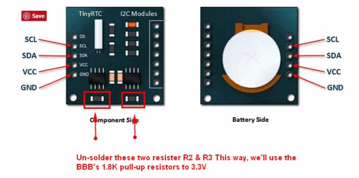
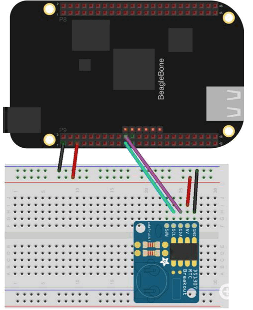
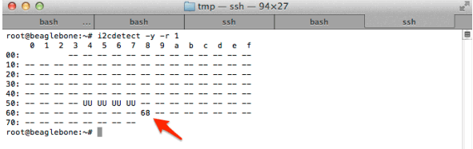

# Set RTC Unit for OT/IoT Device

### Configure DS1307 RTC on BeagleBone-Black Arduino or Raspberry PI


**Program Design Purpose**: Some times we need to set the real time clock (RTC) module for some OT module such as a ship NEMA 0183 data recorder which record the ship engineer, rudder data. or set RTU for some IoT device which operating offline which can not connect to network time server. We will show how to integrate a simple DS1307 RTC unit in some simple micro controller used in OT and IoT  such as BeagleBone-Black, Arduino or Raspberry PI.

[TOC]

### Introduction

The BeagleBone-Black doesn't have a embedded Real-Time Clock module, so if we powered off it and reboot it, if it is not connected to the internet, its time will be reset. We want to add a RTC unit to it so the program we run on the BBB will have RTC. 

We follow this tutorial link to do the RTC config: 

https://learn.adafruit.com/adding-a-real-time-clock-to-beaglebone-black


------

### Program Setup

###### Development Environment : BBB-Debian-V3, Shell

###### Additional Lib/Software Need: N.A

###### Hardware Needed

1. **BeagleBone-Black**:  https://beagleboard.org/black

2. **Tiny RTC I2C DS1307**: https://www.elecrow.com/wiki/index.php?title=Tiny_RTC

   We use RTC I2C DS1307 Module Including Coin Cell Battery to provide time to BBB. This is the description of RTC I2C DS1307 Module:

   

   RTC I2C DS1307 Module Features: 

   ```
   - The DS1307 I2C Real Time Clock chips (RTC) 
   - I2C EEPROM memory 24C32 32K 
   - To adopt LIR2032 rechargeable lithium battery, and with the charging circuit 
   - Solve the problem DS1307 with battery backup cannot read and write.
   - Fully charged, can provide the DS1307 timing. 
   - Compact design, 27mm * 28mm * 8.4mm 
   - Leads to the DS1307 clock pin for the MCU to provide the clock signal.
   ```

3. -

###### Program Files List 

version: v0.1

| Program File           | Execution Env | Description                                                  |
| ---------------------- | ------------- | ------------------------------------------------------------ |
| src/clock_init.sh      | shell         | Time data fetch program to get the real time from RTC        |
| src/rtc-ds1307.service | shell         | Service program to auto run the time fetch program when the BBB rebooted. |


------

### Program Usage

Follow below steps to set the program working for BBB: 

##### Step 1: Changed RTC I2C DS1307 Module for BBB

As the RTC I2C DS1307 Module was designed for the Arduino instead of BBB, when building the kit, we need to remove the pull up resistors (R2 and R3 which in the red box shown in the circuit diagram as shown below). 




We force the RTC to communicate at 3.3V instead of 5V, which is better for the BBB. The resistor needs to be unsoldered is shown below: 




##### Step 2: Connect the RTC to BBB for verification

After removed the pull up resistor of the RTC chip, the next step is connect to BBB for detection. The wiring work is simple: 

1. Connect **VCC** on the RTC I2C DS1307 to the **P9_5** (VCC 5V) or **P9_7** (SYS 5V) pin on the BBB. NOTE: The **P9_5** VCC 5V pin will only be powered if a 5V adapter is plugged in to the barrel jack. If powering over USB use the **P9_7** (SYS 5V) pin instead! 
2. Connect GND on the breakout board to the **P9_1** (GND) pin on the BBB. 
3. Connect SDA on the breakout board to the **P9_20** pin of the BBB 
4. Connect SCL on the breakout board to the **P9_19** pin of the BBB

The wire connection is shown below: 



Verify the wiring by running `i2cdetect -y -r 1` at the command line: If the ID 68 show up, the RTC is ready. As shown below: 



##### Step 3: Synchronize RTC Time with

After finished wired the RTC chip module wired up and verified that we can see the module with i2cdetect, we can set up the module. Now, execute the following to add the RTC chip to new device list:

```
echo ds1307 0x68 > /sys/class/i2c-adapter/i2c-1/new_device
```

After hooked the address to the BBB new device list, we can run the program to check the current time of the DS1307 module: 

```
hwclock -r -f /dev/rtc1
```

If this is the first time the module has been used it will report back Jan 1 2000, so we will need to set the time. The quickest way to set the time on the BeagleBone Black is to execute the following (The BBB need to connect to the internet):

```
/usr/bin/ntpdate -b -s -u pool.ntp.org
```

Now that the system time is set correctly, we can execute the following to write the system time to the DS1307:

```
hwclock -w -f /dev/rtc1
```

We can also verify whether it was set correctly by executing the following command to read the date and time from the DS1307 RTC:

```
hwclock -r -f /dev/rtc1
```


##### Step 4: Create service that will run each time when BBB boot up. 

To start, create a directory and script that will be executed: `mkdir /usr/share/rtc_ds1307`

Copy `clock_init.sh` and `rtc-ds1307.service` in to the folder 

After copied the file, we'll need to actually enable the service so it starts each time as the system boots:

```
systemctl enable rtc-ds1307.service
```

The way to manually start and stop the service: 

```
systemctl start rtc-ds1307.service
systemctl stop rtc-ds1307.service
```

After reboot the BBB, the RTC I2C DS1307 Module can work normally now. 


------

### Problem and Solution

###### 

**OS Platform** : na

**Error Message**: na

**Type**: na

**Solution**: na

**Related Reference**:  na


------

### Reference 

- https://learn.adafruit.com/adding-a-real-time-clock-to-beaglebone-black


------

> Last edit by LiuYuancheng(liu_yuan_cheng@hotmail.com) at 02/12/2020

