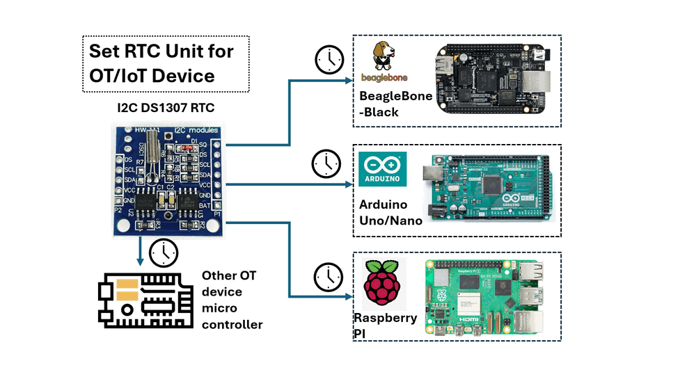
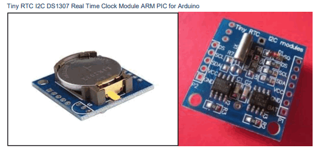
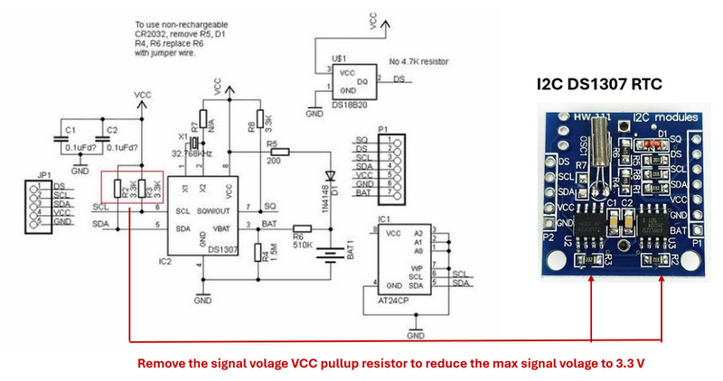
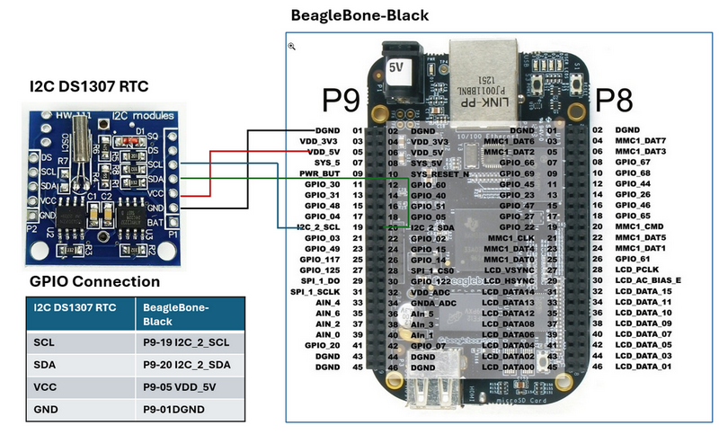
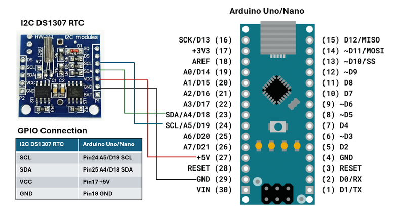
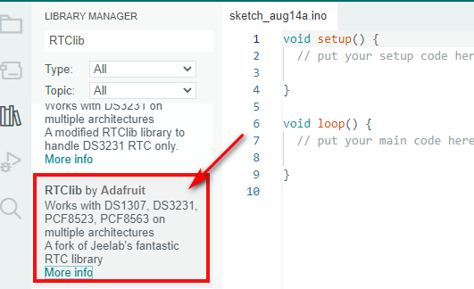
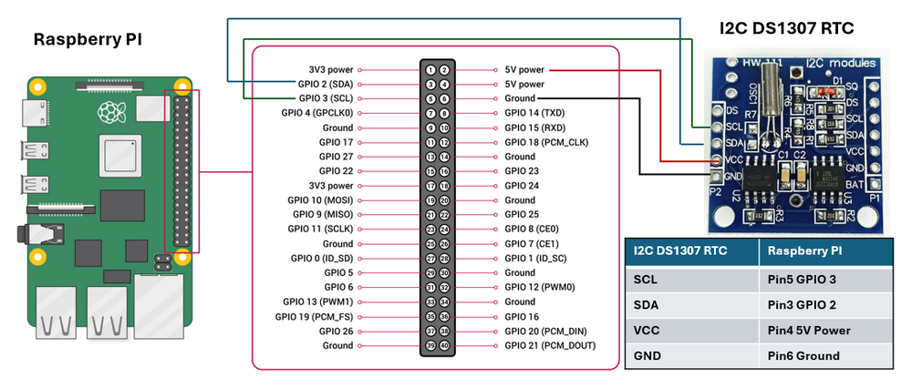
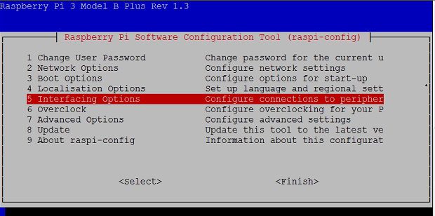
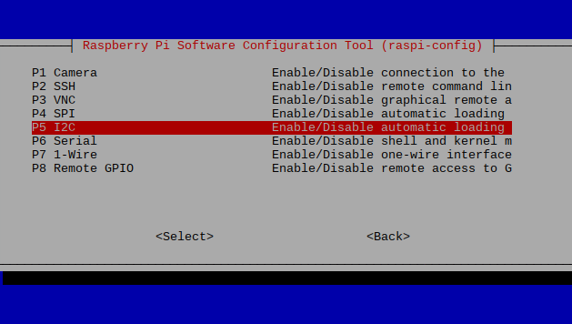

# Set Real-Time Clock Unit for OT/IoT Device

### Configure DS1307 RTC on BeagleBone-Black Arduino or Raspberry-PI



` Figure-00: Project Overview Diagram , version v0.1.2 (2024)`

**Program Design Purpose**: Real-Time Clock (RTC) modules are essential for maintaining accurate timekeeping in various applications, including system clocks, data logging, and alarm systems. In scenarios where devices operate offline, such as a ship's NMEA 0183 data recorder that logs engine and rudder data, or an RTU (Remote Terminal Unit) with real time state change configuration or IoT devices that cannot connect to a network time server, an RTC is crucial. This guide document demonstrates how to integrate a DS1307 RTC module with commonly used microcontrollers in OT (Operational Technology) and IoT (Internet of Things) environments, such as the BeagleBone-Black, Arduino, and Raspberry-Pi.

```
# Created:     2024/08/11
# Version:     v_0.1.2
# Copyright:   N.A
# License:     MIT License
```

**Table of Contents**

[TOC]

- [Set Real-Time Clock Unit for OT/IoT Device](#set-real-time-clock-unit-for-ot-iot-device)
    + [Configure DS1307 RTC on BeagleBone-Black Arduino or Raspberry-PI](#configure-ds1307-rtc-on-beaglebone-black-arduino-or-raspberry-pi)
    + [Introduction](#introduction)
      - [Background Knowledge Introduction](#background-knowledge-introduction)
        * [I2C DS1307 RTC](#i2c-ds1307-rtc)
        * [I2C Communication Protocol](#i2c-communication-protocol)
        * [Micro Controller Introduction](#micro-controller-introduction)
    + [Setting Up the DS1307 RTC for 3.3V OT Devices](#setting-up-the-ds1307-rtc-for-33v-ot-devices)
    + [Setting Up and Using the DS1307 RTC on BeagleBone-Black](#setting-up-and-using-the-ds1307-rtc-on-beaglebone-black)
      - [RTU and Controller Wire Connection](#rtu-and-controller-wire-connection)
      - [Library and Driver Configuration](#library-and-driver-configuration)
      - [Python Program to Get the RTC Data](#python-program-to-get-the-rtc-data)
    + [Setting Up and Using the DS1307 RTC on Arduino](#setting-up-and-using-the-ds1307-rtc-on-arduino)
      - [RTU and Controller Wire Connection](#rtu-and-controller-wire-connection-1)
      - [Library or Driver Configuration](#library-or-driver-configuration)
      - [C++ Program to Read RTC Data](#c---program-to-read-rtc-data)
    + [Setting Up and Using the DS1307 RTC on Raspberry Pi](#setting-up-and-using-the-ds1307-rtc-on-raspberry-pi)
      - [RTU and Controller Wire Connection](#rtu-and-controller-wire-connection-2)
      - [Library or Driver Configuration](#library-or-driver-configuration-1)
      - [Python Program to Get the RTC Data](#python-program-to-get-the-rtc-data-1)
    + [Reference](#reference)
    + [Problem and Solution](#problem-and-solution)

------

### Introduction

A Real-Time Clock (RTC) is a specialized clock that maintains accurate timekeeping even when the main power is turned off. RTCs are crucial in computers, embedded systems, and other electronics where continuous time tracking is necessary. This project will demonstrate how to integrate a DS1307 RTC module with popular microcontrollers used in Operational Technology (OT) and Internet of Things (IoT) applications, such as the BeagleBone-Black, Arduino, and Raspberry Pi. Each example will cover three key areas:

- **Physical Wiring Connection**: Instructions on connecting the DS1307 to the microcontroller's GPIO pins and powering the data transmission.
- **Library or Driver Configuration**: Guidance on installing or configuring the I2C (a two-wire serial communication protocol) library or driver on the microcontroller or in your program.
- **RTC Time Read and Write**: Steps to set the time on the DS1307 and read the time from it using your program.

#### Background Knowledge Introduction

This section provides an overview and reference links for the hardware and protocols used in this project. If you are already familiar with the DS1307 RTC, BeagleBone-Black, Arduino, and Raspberry Pi, you can skip this section.

##### I2C DS1307 RTC

The DS1307 is a widely-used RTC module that communicates via I2C and is suitable for basic timekeeping applications. It includes a coin cell battery, ensuring that it keeps time even when the main power is off. RTC I2C DS1307 Module Including CR2032 Coin Cell Battery is shown below:



` Figure-01: I2C DS1307 RTC with CR2032 battery , version v0.1.2 (2024)`

**Key Features of the DS1307 RTC:**

- **Battery Backup**: Ensures timekeeping continues even during power loss.
- **I2C Interface**: Allows communication with microcontrollers via the I2C protocol.
- **Time and Date Management**: Tracks hours, minutes, seconds, day, month, and year.
- **Low Power Consumption**: Designed to consume minimal power, extending battery life.

DS1307 RTC Detailed document link: https://www.analog.com/media/en/technical-documentation/data-sheets/ds1307.pdf

##### I2C Communication Protocol

I2C is **a two-wire serial communication protocol using a serial data line (SDA) and a serial clock line (SCL)**. The protocol supports multiple target devices on a communication bus and can also support multiple controllers that send and receive commands and data. Detail link: https://www.ti.com/lit/an/sbaa565/sbaa565.pdf?ts=1723523827811&ref_url=https%253A%252F%252Fwww.google.com%252F#:~:text=I2C%20is%20a%20two%2Dwire,and%20receive%20commands%20and%20data.

##### Micro Controller Introduction

- **BeagleBone-Black**: https://docs.beagleboard.org/latest/boards/beaglebone/black/ch04.html

- **Arduino:** https://www.arduino.cc/

- **Raspberry PI**: https://www.raspberrypi.com/


------

### Setting Up the DS1307 RTC for 3.3V OT Devices

According to the DS1307 RTC datasheet (page 3/14), the maximum voltage for the SDA and SCL lines is 5.0V. If your OT microcontroller operates at 3.3V signal levels, you can adapt the DS1307 module by removing the two pull-up resistors connected to the SDA and SCL lines before link it to your OT controller.

In the circuit diagram below, the SDA and SCL lines are connected to VCC through two 3.3kΩ pull-up resistors, R2 and R3.



` Figure-02: I2C DS1307 circuit diagram and resistor modification, version v0.1.2 (2024)`

By unsoldering these two resistors, the output voltage will be directly from the DS1307 chip, which has a maximum output of 3.5V. This adjustment ensures compatibility with OT devices that operate on a 3.3V system.


------

### Setting Up and Using the DS1307 RTC on BeagleBone-Black

This section explains how to connect and configure the DS1307 RTC with the BeagleBone Black.

#### RTU and Controller Wire Connection

1. **VCC Connection**: Connect the **VCC** pin on the DS1307 RTC to the **P9_5** (VCC 5V) or **P9_7** (SYS 5V) pin on the BeagleBone Black. **Note**: The **P9_5** VCC 5V pin will only be powered if a 5V adapter is plugged into the barrel jack. If powering the BeagleBone Black via USB, use the **P9_7** (SYS 5V) pin instead.
2. **GND Connection**: Connect the **GND** pin on the DS1307 RTC to the **P9_1** (GND) pin on the BeagleBone Black.
3. **SDA Connection**: Connect the **SDA** pin on the DS1307 RTC to the **P9_20** pin on the BeagleBone Black.
4. **SCL Connection**: Connect the **SCL** pin on the DS1307 RTC to the **P9_19** pin on the BeagleBone Black.

The connection detail is shown below:



` Figure-03: Wire Connection of DS1307 RTC on BeagleBone-Black , version v0.1.2 (2024)`

To check if the DS1307 is properly connected and recognized by the BeagleBone Black, run the command `i2cdetect -y -r 1`. The address `0x68` should appear, indicating that the DS1307 module is correctly connected.

#### Library and Driver Configuration

Follow below steps to setup the DS1307 module

**Step1: Synchronize RTC Time with internet** 

Once the DS1307 module is wired up and recognized, you can set up the module by adding it to the device list with below commands :

```
echo ds1307 0x68 > /sys/class/i2c-adapter/i2c-1/new_device
```

After adding the DS1307 to the BeagleBone Black’s device list, check the current time on the module with cmd:

```
hwclock -r -f /dev/rtc1
```

If this is the first time the module has been used, it may display the default date of `Jan 1, 2000`. To set the time, connect the BeagleBone Black to the internet and run to synchronize the time or use time cmd to setup the time directly:

```
/usr/bin/ntpdate -b -s -u pool.ntp.org
```

Once the system time is set correctly, write the system time to the DS1307:

```
hwclock -w -f /dev/rtc1
```

Verify the time has been set correctly by reading the date and time from the DS1307 RTC:

```
hwclock -r -f /dev/rtc1
```

**Step 2: Create a Time Correct Service to Run on Boot (Optional)**

To start, create a directory and script that will be executed: `mkdir /usr/share/rtc_ds1307`

Copy `clock_init.sh` and `rtc-ds1307.service` in to the folder 

Enable the service to start on boot:

```
systemctl enable rtc-ds1307.service
```

The way to manually start and stop the service: 

```
systemctl start rtc-ds1307.service
systemctl stop rtc-ds1307.service
```

After rebooting the BeagleBone Black, the DS1307 RTC module should function correctly, allowing your program to utilize the system time library.

**Step 3: Install the IC2 Library **

If your don't want to use the service in step 2, for your python program which to enable I2C1 (usually used for communication), you can use below cmd: 

```
echo BB-I2C1 > /sys/devices/platform/bone_capemgr/slots
```

Install required library

```
sudo apt-get update
sudo apt-get install python3-pip
sudo pip3 install Adafruit_BBIO smbus2
```

#### Python Program to Get the RTC Data

After finished the config, you can use the below example to read the time data from the RTC:

```python
import smbus2
import time
# Define the I2C bus and address of the DS1307 RTC
bus = smbus2.SMBus(1)  # Use '1' for I2C1 on BeagleBone Black
DS1307_ADDRESS = 0x68
# Function to convert BCD to decimal
def bcd_to_dec(bcd):
    return (bcd // 16 * 10) + (bcd % 16)
# Function to read the time from the DS1307 RTC
def read_time():
    # Read the time registers from the DS1307
    second = bus.read_byte_data(DS1307_ADDRESS, 0x00)
    minute = bus.read_byte_data(DS1307_ADDRESS, 0x01)
    hour = bus.read_byte_data(DS1307_ADDRESS, 0x02)
    day = bus.read_byte_data(DS1307_ADDRESS, 0x04)
    month = bus.read_byte_data(DS1307_ADDRESS, 0x05)
    year = bus.read_byte_data(DS1307_ADDRESS, 0x06)
    # Convert the BCD values to decimal
    second = bcd_to_dec(second)
    minute = bcd_to_dec(minute)
    hour = bcd_to_dec(hour)
    day = bcd_to_dec(day)
    month = bcd_to_dec(month)
    year = bcd_to_dec(year) + 2000  # The DS1307 only gives the last two digits of the year
    return (year, month, day, hour, minute, second)
# Main loop to print the time every second
while True:
    time_data = read_time()
    print("Date: {:02d}/{:02d}/{:04d} Time: {:02d}:{:02d}:{:02d}".format(
        time_data[2], time_data[1], time_data[0], time_data[3], time_data[4], time_data[5]))
    time.sleep(1)
```

For detailed code and program please refer to the programs in folder  `src/rtcBBB` . 


------

### Setting Up and Using the DS1307 RTC on Arduino

This section explains how to connect and configure the DS1307 RTC with the Arduino Uno/Nano.

#### RTU and Controller Wire Connection

1. Connect the **VCC** pin on the DS1307 RTC to the **Pin 17 (+5V)** on the Arduino Uno/Nano.
2. Connect the **GND** pin on the RTC module to the **Pin 19 (GND)** on the Arduino Uno/Nano.
3. Connect the **SDA** pin on the RTC module to **Pin 25 (A4/D18)** on the Arduino Uno/Nano.
4. Connect the **SCL** pin on the RTC module to **Pin 24 (A5/D19)** on the Arduino Uno/Nano.

The connection detail is shown below:



` Figure-04: Wire Connection of DS1307 RTC on Arduino , version v0.1.2 (2024)`

#### Library or Driver Configuration

To interface with the DS1307 RTC module using I2C on an Arduino, you need to include the `Wire.h` library, which facilitates I2C communication. Additionally, install the `RTClib` library through the Arduino IDE, which simplifies interaction with the DS1307 and other RTC modules.(As shown below)



` Figure-05: Install RTC lib from Arduino IDE , version v0.1.2 (2024)`

For the RTC lib please refer to this link: https://www.arduino.cc/reference/en/libraries/rtclib/ , or the project repo: https://github.com/adafruit/RTClib

#### C++ Program to Read RTC Data

Once the configuration is complete, you can use the following example code to read time data from the RTC module:

```c++
#include <Wire.h>
#include <RTClib.h>  // You need to install the RTClib library in the Arduino IDE

RTC_DS1307 rtc;

void setup() {
  // Start the serial communication
  Serial.begin(9600);
  // Start the I2C communication
  Wire.begin();
  // Check if the RTC is connected properly
  if (!rtc.begin()) {
    Serial.println("Couldn't find RTC");
    while (1);
  }

  // Check if the RTC is running
  if (!rtc.isrunning()) {
    Serial.println("RTC is NOT running!");
    // Uncomment the following line to set the RTC time to the time the sketch was compiled
    // rtc.adjust(DateTime(F(__DATE__), F(__TIME__)));
  }
}

void loop() {
  // Get the current time from the RTC
  DateTime now = rtc.now();

  // Print the current date and time to the serial monitor
  Serial.print(now.year(), DEC);
  Serial.print('/');
  Serial.print(now.month(), DEC);
  Serial.print('/');
  Serial.print(now.day(), DEC);
  Serial.print(" ");
  Serial.print(now.hour(), DEC);
  Serial.print(':');
  Serial.print(now.minute(), DEC);
  Serial.print(':');
  Serial.print(now.second(), DEC);
  Serial.println();

  // Wait 1 second before repeating
  delay(1000);
}

```

This code initializes the DS1307, checks if it's running, and prints the current date and time to the serial monitor every second. For detailed code and program please refer to `src/rtcArduino` . 


------

### Setting Up and Using the DS1307 RTC on Raspberry Pi

This section explains how to connect and configure the DS1307 RTC with the Raspberry PI b3+.

#### RTU and Controller Wire Connection

1. Connect the **VCC** pin on the DS1307 RTC to **Pin 2 or Pin 4 (+5V)** on the Raspberry Pi.
2. Connect the **GND** pin on the RTC module to **Pin 6 (GND)** on the Raspberry Pi.
3. Connect the **SDA** pin on the RTC module to **Pin 3 (GPIO2, SDA1)** on the Raspberry Pi.
4. Connect the **SCL** pin on the RTC module to **Pin 5 (GPIO3, SCL1)** on the Raspberry Pi.

The connection detail is shown below:



` Figure-06: Wire Connection of DS1307 RTC on Raspberry Pi, version v0.1.2 (2024)`

Same as setting on BeagleBone-Black, to verify that the DS1307 RTC is properly connected and recognized, run `i2cdetect -y 1` in the terminal. You should see the address `0x68`, indicating that the DS1307 is detected.

#### Library or Driver Configuration

To interface with the DS1307 RTC module using I2C on a Raspberry Pi, you can use the `smbus` or `smbus2` library in Python. First, enable the I2C interface on the Raspberry Pi with below cmd:

```
sudo raspi-config
```



` Figure-07: Raspberry PI interface configuration page, version v0.1.2 (2024)`

Then navigate to `Interfacing Options` > `I2C` and enable it as shown below:



` Figure-06: Raspberry PI I2C2 configuration page, version v0.1.2 (2024)`

Next, install the necessary packages by running:

```
sudo apt-get install -y python-smbus i2c-tools
```

For newer Raspberry Pi models, open I2C bus 1 using `smbus.SMBus(1)` in your Python code.

#### Python Program to Get the RTC Data

Once the configuration is complete, you can use the following example code to read time data from the RTC module:

```python
import smbus
import time

# Define the I2C bus and address of the DS1307 RTC
bus = smbus.SMBus(1)  # Use '1' for I2C on newer Raspberry Pi models
DS1307_ADDRESS = 0x68

# Function to convert BCD to decimal
def bcd_to_dec(bcd):
    return (bcd // 16 * 10) + (bcd % 16)

# Function to read the time from the DS1307 RTC
def read_time():
    # Read the time registers from the DS1307
    second = bus.read_byte_data(DS1307_ADDRESS, 0x00)
    minute = bus.read_byte_data(DS1307_ADDRESS, 0x01)
    hour = bus.read_byte_data(DS1307_ADDRESS, 0x02)
    day = bus.read_byte_data(DS1307_ADDRESS, 0x04)
    month = bus.read_byte_data(DS1307_ADDRESS, 0x05)
    year = bus.read_byte_data(DS1307_ADDRESS, 0x06)

    # Convert the BCD values to decimal
    second = bcd_to_dec(second)
    minute = bcd_to_dec(minute)
    hour = bcd_to_dec(hour)
    day = bcd_to_dec(day)
    month = bcd_to_dec(month)
    year = bcd_to_dec(year) + 2000  # The DS1307 only gives the last two digits of the year

    return (year, month, day, hour, minute, second)

# Main loop to print the time every second
while True:
    time_data = read_time()
    print("Date: {:02d}/{:02d}/{:04d} Time: {:02d}:{:02d}:{:02d}".format(
        time_data[2], time_data[1], time_data[0], time_data[3], time_data[4], time_data[5]))
    
    time.sleep(1)

```

For detailed code and program please refer to `src/rtcRspI` . 

------

### Reference 

- https://learn.adafruit.com/adding-a-real-time-clock-to-beaglebone-black

- https://www.instructables.com/DS1307-Real-Time-Clock-RTC-With-Arduino/

- https://wiki.seeedstudio.com/Pi_RTC-DS1307/

  

------

### Problem and Solution

- Refer to `doc/ProblemAndSolution.md`

------

> Last edit by LiuYuancheng(liu_yuan_cheng@hotmail.com) at 14/08/2024, if you have any problem, please send me a message. 
